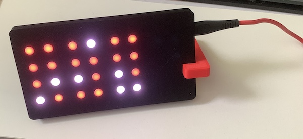
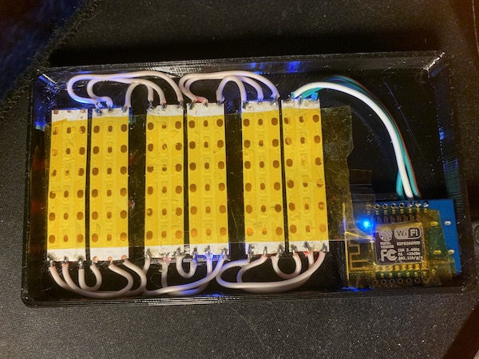

# esp8266-bcdclock

to be used with esp8266 D1 mini board and 144 leds/m ws2812 5v led strip

connect led strip to 5v, gnd and D4

cut strip to 7 segments and connect them to each other (do not solder in place, use tape strip to fix segments in place and then take them out of enclosure to solder)

upload nodemcu firmware via esptool.py and lua files with <a href="https://esp8266.ru/category/esplorer-info/">ESPlorer.jar</a>
